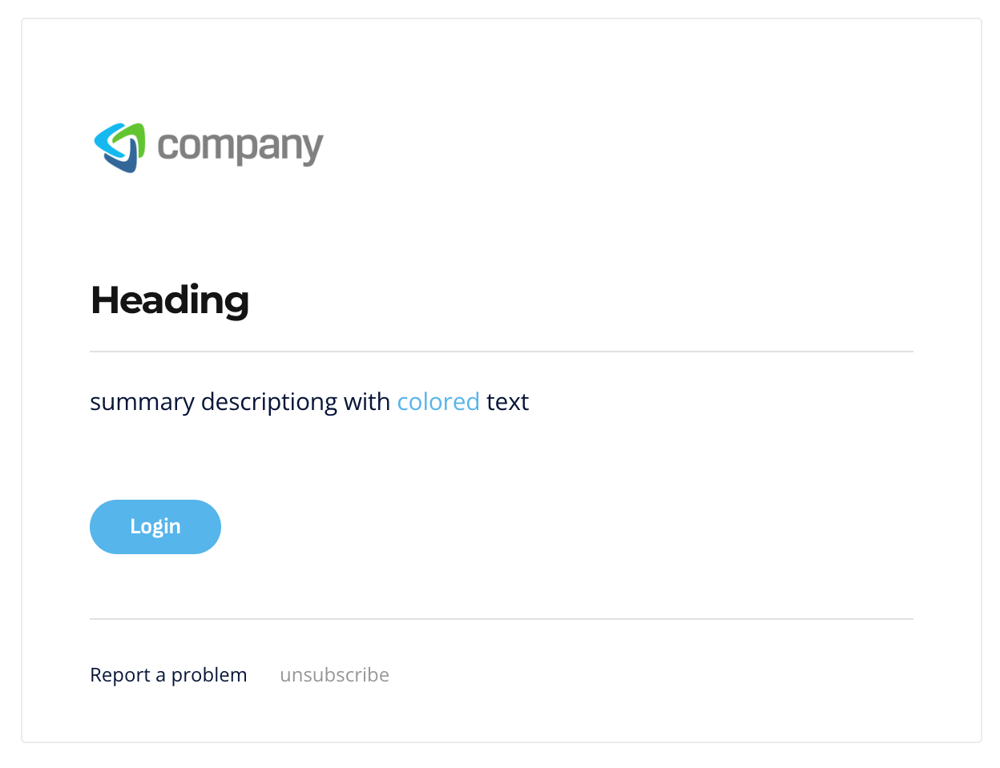
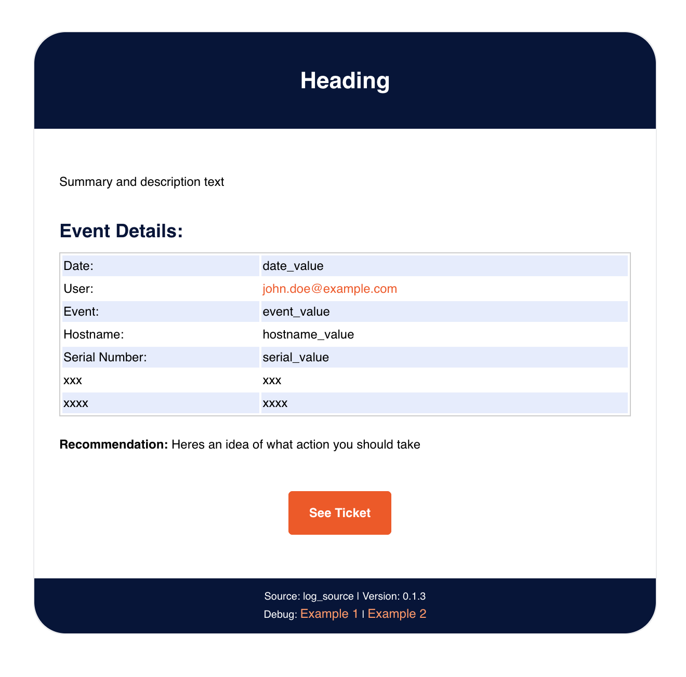
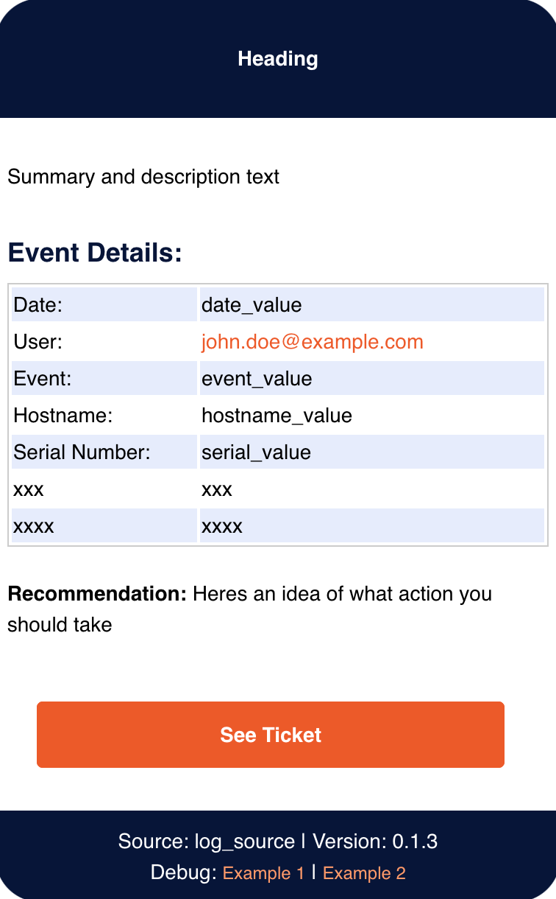

# HTML Email Templates

This is a couple of html email templates I use in automation workflows. They are not my originally code but they have been customized a lot as I use them.

# Simple Email Template:

This is a template I use for simple message and notification workflows. Like, something just finished running, or the output of some event is not what I expected. 

# Formatted Email Template:

Desktop

Mobile